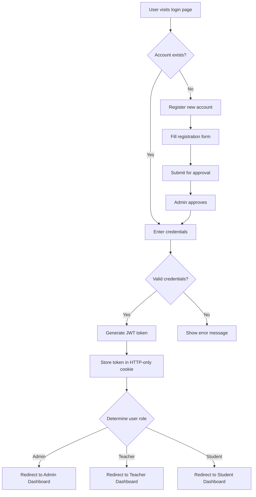
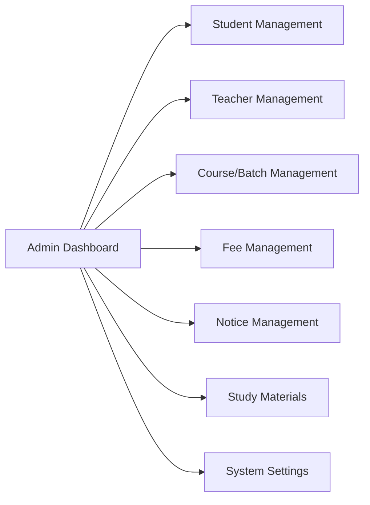
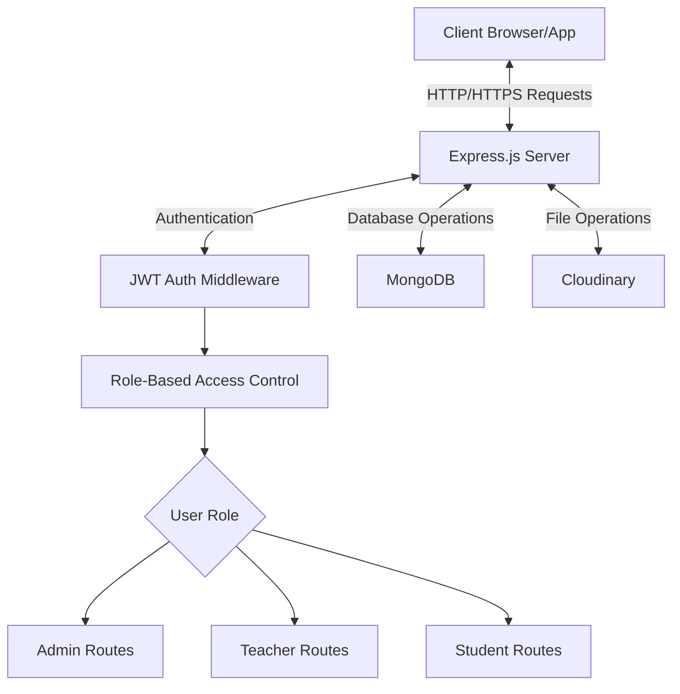

# HighQ Classes - User Workflow Documentation

This document explains the functional flow of the HighQ Classes application from the user's perspective, starting with login and covering the different user experiences based on roles.

## 🔑 Authentication Flow

### 1. Login Process

1. User navigates to the login page (`/login`)
2. Enters email and password
3. System validates credentials against the database
4. Upon successful login:
    - JWT token is generated with user role and expiry time
    - Token is stored in HTTP-only cookie
    - User is redirected to appropriate dashboard based on role

### 2. Registration Process

1. New user clicks "Register" on the login page
2. Fills out registration form with:
    - Personal details (name, email, phone)
    - Password (securely hashed on submission)
    - Role selection (if applicable, or defaulted to Student)
3. For students:
    - Additional fields for course/batch interests
4. For teachers:
    - Qualifications, specializations, experience
5. Submission creates a "pending" account
6. Admin approves the registration
7. User receives confirmation email with login instructions

### 3. Password Reset

1. User clicks "Forgot Password" on login page
2. Enters registered email address
3. System sends password reset OTP to email
4. User enters OTP and creates new password
5. Password is securely updated in database

## 👑 Admin User Experience

### 1. Dashboard Overview

After login, admin sees:

-   Overview statistics (total students, teachers, courses, batches)
-   Recent activity feed
-   Important notices
-   Quick action buttons

### 2. Student Management

1. View complete student list with filters and search
2. Add new student:
    - Create user account
    - Assign to batch(es)
    - Set fee structure
3. Edit student details:
    - Personal information
    - Batch assignments
    - Fee adjustments
4. View student profiles:
    - Attendance records
    - Fee payment history
    - Academic performance
5. Remove student (deactivate account)

### 3. Teacher Management

1. View all teachers with filters
2. Add new teacher:
    - Create user account
    - Set qualifications and specializations
    - Assign to courses/batches
3. Edit teacher details:
    - Contact information
    - Course/batch assignments
4. View teacher performance:
    - Student feedback
    - Attendance records
    - Class completions
5. Remove teacher (deactivate account)

### 4. Course/Batch Management

1. Create new courses:
    - Course details (name, description, duration)
    - Set fee structure
    - Define syllabus
2. Create batches for courses:
    - Schedule (days, times)
    - Assign teacher
    - Set start/end dates
3. Manage existing courses/batches:
    - Update details
    - Add/remove students
    - Change teacher assignments

### 5. Fee Management

1. Set fee structures for courses
2. View fee collection status:
    - By student
    - By batch
    - By month/period
3. Generate fee reminders
4. Record fee payments
5. Generate receipts and reports

### 6. Notice Management

1. Create announcements for:
    - All users
    - Specific roles
    - Specific batches
2. Edit/delete notices
3. Schedule notices for future posting
4. View notice read statistics

### 7. Study Materials

1. Upload study materials:
    - Documents (PDF)
    - Images
    - Videos
    - Links to external resources
2. Assign materials to:
    - Specific courses
    - Specific batches
    - Specific students
3. Organize materials by category/subject
4. Monitor usage statistics

## 👨‍🏫 Teacher User Experience

### 1. Dashboard Overview

After login, teachers see:

-   Their assigned batches
-   Today's schedule
-   Recent notices
-   Student attendance overview

### 2. Batch Management

1. View assigned batches
2. Access batch details:
    - Student list
    - Schedule
    - Course content
3. Record student attendance
4. View attendance history

### 3. Study Materials

1. View existing study materials for assigned courses
2. Upload new study materials for their batches
3. Organize materials by topic/session
4. Monitor student engagement with materials

### 4. Notice Creation

1. Create notices for:
    - All their students
    - Specific batches
    - Individual students
2. Edit/delete their notices
3. Schedule notices for future posting

### 5. Class Recordings

1. Upload class recordings
2. Organize by date and topic
3. Make available to students for limited time (3 days)
4. Monitor viewing statistics

## 👨‍🎓 Student User Experience

### 1. Dashboard Overview

After login, students see:

-   Their batch details
-   Upcoming classes
-   Recent notices
-   Fee payment status
-   Recent study materials

### 2. Profile Management

1. View personal details
2. Update contact information
3. Change password
4. Upload profile picture

### 3. Course Access

1. View enrolled courses
2. Access course materials:
    - Class notes
    - Study resources
    - Assignments
3. View attendance record
4. Check upcoming classes

### 4. Fee Management

1. View fee structure
2. Check payment history
3. See payment due dates
4. Download fee receipts

### 5. Study Materials

1. Browse available study materials
2. Download/view resources
3. Access class recordings (last 3 days)
4. Search for specific topics

## 📱 Mobile Responsiveness

All interfaces adapt to different screen sizes:

1. **Desktop View**: Full functionality with expanded layouts
2. **Tablet View**: Optimized layouts with collapsible sections
3. **Mobile View**:
    - Simplified navigation with hamburger menu
    - Prioritized information
    - Touch-friendly buttons and inputs
    - Stackable content blocks

## 🔄 Data Flow Architecture

1. Client makes authenticated requests to backend API
2. JWT middleware validates token and extracts user info
3. Role middleware checks permissions for the requested resource
4. Controllers process the request and interact with the database
5. Data is returned to client with appropriate formatting
6. File uploads are processed through Cloudinary

## 🔐 Security Implementation

1. **Authentication**: JWT-based with proper expiration
2. **Authorization**: Role-based access control
3. **Data Protection**:
    - Password hashing with bcrypt
    - Sensitive data encryption
    - HTTPS for all communications
4. **Input Validation**:
    - Server-side validation with express-validator
    - Client-side validation for user experience
5. **File Security**:
    - Type validation
    - Size limits
    - Secure storage with Cloudinary
6. **API Protection**:
    - Rate limiting
    - CORS configuration
    - Helmet.js security headers
