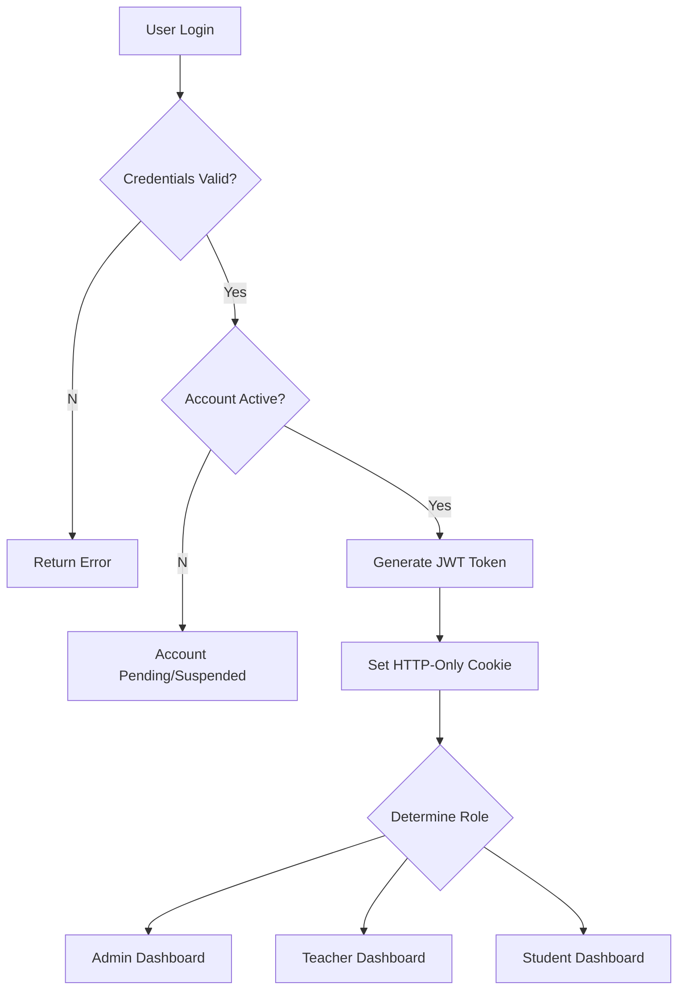

# 🔐 HighQ Classes - Authentication System Documentation

## Table of Contents

1. [Overview](#overview)
2. [Architecture](#architecture)
3. [User Roles & Models](#user-roles--models)
4. [Authentication Flow](#authentication-flow)
5. [API Endpoints](#api-endpoints)
6. [Middleware Usage](#middleware-usage)
7. [Security Features](#security-features)
8. [Frontend Integration](#frontend-integration)
9. [Error Handling](#error-handling)
10. [Testing Guide](#testing-guide)
11. [Troubleshooting](#troubleshooting)

---

## Overview

The HighQ Classes authentication system provides secure user management with role-based access control. It supports three user types: **Admin**, **Teacher**, and **Student**, each with specific permissions and capabilities.

### Key Features

-   ✅ JWT-based authentication with HTTP-only cookies
-   ✅ Role-based authorization (RBAC)
-   ✅ Account security (lockout, password policies)
-   ✅ Password reset with OTP
-   ✅ Input validation and sanitization
-   ✅ XSS and NoSQL injection protection
-   ✅ Rate limiting and security headers

---

## Architecture

### Database Design

```
┌─────────────────┐    ┌─────────────────┐
│   User (Base)   │    │   Admin Profile │
│   ============= │    │   ============= │
│   - id          │◄───┤   - user_id     │
│   - name        │    │   - department  │
│   - email       │    │   - permissions │
│   - password    │    │   - access_level│
│   - mobile      │    └─────────────────┘
│   - role        │
│   - status      │    ┌─────────────────┐
│   - security    │    │ Teacher Profile │
│   - timestamps  │    │   ============= │
└─────────────────┘    │   - user_id     │
                       │   - qualification│
                       │   - subjects    │
                       │   - batches     │
                       └─────────────────┘

                       ┌─────────────────┐
                       │ Student Profile │
                       │   ============= │
                       │   - user_id     │
                       │   - grade       │
                       │   - courses     │
                       │   - attendance  │
                       └─────────────────┘
```

### Authentication Flow



---

## User Roles & Models

### 1. Base User Model (`models/User.js`)

All users share these common fields:

```javascript
{
  name: String,           // Full name (required, 3-50 chars)
  email: String,          // Unique email (required, validated)
  password: String,       // Hashed password (required, min 6 chars)
  mobile: String,         // 10-digit mobile number (required)
  role: String,           // 'admin', 'teacher', 'student'
  profilePicture: String, // URL to profile image
  status: String,         // 'pending', 'active', 'suspended'

  // Security fields
  failedLoginAttempts: Number,    // Count of failed logins
  lockoutUntil: Date,            // Account lockout timestamp
  resetPasswordOTP: String,       // Hashed OTP for password reset
  resetPasswordExpiry: Date,      // OTP expiry time
  lastLogin: Date,               // Last successful login

  createdAt: Date,               // Account creation time
  updatedAt: Date                // Last update time
}
```

#### User Model Methods

```javascript
// Password operations
user.comparePassword(candidatePassword); // Compare plain text with hash
user.generateAuthToken(); // Generate JWT token
user.generateResetPasswordToken(); // Generate OTP for password reset

// Security operations
user.isAccountLocked(); // Check if account is locked
user.handleFailedLogin(); // Handle failed login attempt
user.resetFailedLoginAttempts(); // Reset failed login counter
```

### 2. Admin Model (`models/Admin.js`)

Extended profile for admin users:

```javascript
{
  user: ObjectId,                    // Reference to User model
  department: String,                // 'Academic', 'Administrative', 'IT', etc.
  permissions: [String],             // Array of permission strings
  accessLevel: Number,               // 1-5 access level
  employeeId: String,                // Unique employee ID
  designation: String,               // Job title
  isActive: Boolean,                 // Admin status
  lastActivity: Date,                // Last admin activity
  managedDepartments: [String],      // Departments they manage
  systemSettings: {                  // System-level permissions
    canManageUsers: Boolean,
    canManageRoles: Boolean,
    canAccessReports: Boolean,
    canManageSystem: Boolean
  }
}
```

#### Admin Permissions

```javascript
const ADMIN_PERMISSIONS = [
    "user_management", // Create, update, delete users
    "course_management", // Manage courses and curriculum
    "batch_management", // Manage student batches
    "fee_management", // Handle fee collection
    "notice_management", // Create system notices
    "attendance_management", // View/manage attendance
    "material_management", // Manage study materials
    "recording_management", // Manage recorded sessions
    "system_settings", // System configuration
    "reports_access", // Access to reports and analytics
];
```

### 3. Teacher Model (`models/Teacher.js`)

Extended profile for teacher users:

```javascript
{
  user: ObjectId,                    // Reference to User model
  qualification: String,             // Educational background (required)
  experience: Number,                // Years of experience
  specialization: String,            // Subject specialization (required)
  bio: String,                       // Biography
  subjects: [String],                // Subjects they teach
  joinDate: Date,                    // Joining date
  batches: [ObjectId],               // Assigned batches (ref: Batch)
  courseIds: [ObjectId]              // Courses they handle (ref: Course)
}
```

### 4. Student Model (`models/Student.js`)

Extended profile for student users:

```javascript
{
  user: ObjectId,                    // Reference to User model
  gender: String,                    // 'male', 'female', 'other'
  dateOfBirth: Date,                 // Date of birth
  parentName: String,                // Guardian name
  parentContact: String,             // Guardian contact
  address: {                         // Full address
    street: String,
    city: String,
    state: String,
    zipCode: String
  },
  batch: ObjectId,                   // Enrolled batch (ref: Batch)
  courses: [ObjectId],               // Enrolled courses (ref: Course)
  grade: String,                     // Current grade/class
  schoolName: String,                // School name
  joinDate: Date,                    // Enrollment date
  attendance: [{                     // Attendance records
    date: Date,
    status: String,                  // 'present', 'absent', 'leave'
    batch: ObjectId
  }],
  examHistory: [{                    // Exam results
    examTitle: String,
    score: Number,
    total: Number,
    date: Date
  }]
}
```

---

## Authentication Flow

### 1. Registration Process

```javascript
// Step 1: Create base user
const user = new User({
    name: "John Doe",
    email: "john@example.com",
    password: "SecurePass123", // Will be hashed automatically
    mobile: "1234567890",
    role: "student",
    status: role === "admin" ? "active" : "pending",
});

// Step 2: Create role-specific profile
if (role === "student") {
    const studentProfile = new Student({
        user: user._id,
        grade: "10th",
        parentName: "Parent Name",
    });
}
```

### 2. Login Process

```javascript
// Step 1: Validate credentials
const user = await User.findOne({ email }).select("+password");

// Step 2: Security checks
if (user.isAccountLocked()) {
    return res.status(403).json({ message: "Account locked" });
}

// Step 3: Verify password
const isMatch = await user.comparePassword(password);

// Step 4: Generate JWT and set cookie
const token = user.generateAuthToken();
res.cookie("authToken", token, {
    httpOnly: true,
    secure: process.env.NODE_ENV === "production",
    maxAge: 7 * 24 * 60 * 60 * 1000, // 7 days
});
```

### 3. Password Reset Flow

```javascript
// Step 1: Request reset
const otp = await user.generateResetPasswordToken();
await emailService.sendPasswordResetOTP(user.email, otp);

// Step 2: Verify OTP and reset
const isValidOTP = await bcrypt.compare(otp, user.resetPasswordOTP);
if (isValidOTP && Date.now() < user.resetPasswordExpiry) {
    user.password = newPassword; // Will be hashed automatically
    user.resetPasswordOTP = undefined;
    user.resetPasswordExpiry = undefined;
    await user.save();
}
```

---

## API Endpoints

### Public Authentication Routes

#### Register User

```http
POST /api/auth/register
Content-Type: application/json

{
  "name": "John Doe",
  "email": "john@example.com",
  "password": "SecurePass123",
  "mobile": "1234567890",
  "role": "student"
}

Response:
{
  "success": true,
  "message": "Registration successful! Please wait for approval.",
  "data": {
    "id": "user_id",
    "name": "John Doe",
    "email": "john@example.com",
    "role": "student",
    "status": "pending"
  }
}
```

#### Login User

```http
POST /api/auth/login
Content-Type: application/json

{
  "email": "john@example.com",
  "password": "SecurePass123"
}

Response:
{
  "success": true,
  "message": "Login successful",
  "data": {
    "id": "user_id",
    "name": "John Doe",
    "email": "john@example.com",
    "role": "student"
  },
  "token": "jwt_token_here"
}
```

#### Forgot Password

```http
POST /api/auth/forgot-password
Content-Type: application/json

{
  "email": "john@example.com"
}

Response:
{
  "success": true,
  "message": "If your email is registered, you will receive a reset OTP"
}
```

#### Reset Password

```http
POST /api/auth/reset-password
Content-Type: application/json

{
  "email": "john@example.com",
  "otp": "123456",
  "newPassword": "NewSecurePass123"
}

Response:
{
  "success": true,
  "message": "Password reset successfully"
}
```

### Protected Authentication Routes

#### Get Current User

```http
GET /api/auth/me
Authorization: Bearer <token>
Cookie: authToken=<token>

Response:
{
  "success": true,
  "data": {
    "id": "user_id",
    "name": "John Doe",
    "email": "john@example.com",
    "role": "student",
    "profilePicture": "/placeholder.svg",
    "createdAt": "2024-01-01T00:00:00.000Z"
  }
}
```

#### Update Profile

```http
PUT /api/auth/update-profile
Authorization: Bearer <token>
Content-Type: application/json

{
  "name": "John Updated",
  "mobile": "9876543210",
  "profilePicture": "https://example.com/picture.jpg"
}

Response:
{
  "success": true,
  "message": "Profile updated successfully",
  "data": {
    "id": "user_id",
    "name": "John Updated",
    "email": "john@example.com",
    "mobile": "9876543210"
  }
}
```

#### Change Password

```http
PUT /api/auth/change-password
Authorization: Bearer <token>
Content-Type: application/json

{
  "currentPassword": "CurrentPass123",
  "newPassword": "NewSecurePass123"
}

Response:
{
  "success": true,
  "message": "Password changed successfully"
}
```

#### Logout

```http
POST /api/auth/logout
Authorization: Bearer <token>

Response:
{
  "success": true,
  "message": "Logged out successfully"
}
```

### Admin-Only Routes

#### Create User (Admin)

```http
POST /api/admin/user
Authorization: Bearer <admin_token>
Content-Type: application/json

{
  "name": "New Teacher",
  "email": "teacher@example.com",
  "password": "TeacherPass123",
  "mobile": "1234567890",
  "role": "teacher",
  "qualification": "M.Sc Physics",
  "specialization": "Physics",
  "experience": 5
}

Response:
{
  "success": true,
  "message": "Teacher created successfully",
  "data": {
    "user": { /* user data */ },
    "profile": { /* teacher profile data */ }
  }
}
```

---

## Middleware Usage

### Authentication Middleware

#### Protect Routes (Authentication Required)

```javascript
import { protect } from "../middleware/authMiddleware.js";

// Protect a route - requires valid JWT token
router.get("/protected-route", protect, controller);
```

#### Role-Based Authorization

```javascript
import { protect, authorize } from "../middleware/authMiddleware.js";

// Admin only routes
router.get("/admin-only", protect, authorize("admin"), adminController);

// Multiple roles allowed
router.get(
    "/staff-only",
    protect,
    authorize(["admin", "teacher"]),
    staffController
);

// Single role
router.get("/student-only", protect, authorize("student"), studentController);
```

#### Student-Specific Authorization

```javascript
import { protect, authorizeStudent } from "../middleware/authMiddleware.js";

// Students can only access their own data
router.get("/student/:id/profile", protect, authorizeStudent, getProfile);
```

### Input Validation Middleware

```javascript
import {
    validateRegistration,
    validateLogin,
    validateAdminCreateUser,
} from "../middleware/validateRequestBody.js";

// Use validation middleware
router.post("/register", validateRegistration, register);
router.post("/login", validateLogin, login);
router.post("/admin/user", validateAdminCreateUser, createUser);
```

### Security Middleware

```javascript
import {
    sanitizeRequest,
    xssClean,
    authLimiter,
} from "../middleware/securityMiddleware.js";

// Apply security middleware
app.use(sanitizeRequest); // NoSQL injection prevention
app.use(xssClean); // XSS protection
app.use("/api/auth", authLimiter); // Rate limiting for auth routes
```

---

## Security Features

### 1. Password Security

-   **Hashing**: bcrypt with salt rounds (10)
-   **Strength Requirements**: Minimum 6 characters, uppercase, lowercase, number
-   **Auto-hashing**: Password automatically hashed on save

### 2. Account Security

-   **Account Lockout**: 5 failed attempts = 15-minute lockout
-   **Status Management**: pending, active, suspended states
-   **Session Management**: JWT tokens with expiration

### 3. Input Security

-   **Validation**: express-validator for all inputs
-   **Sanitization**: NoSQL injection prevention
-   **XSS Protection**: Script tag and HTML entity cleaning

### 4. Rate Limiting

-   **General API**: 100 requests per 15 minutes
-   **Auth Routes**: 5 attempts per 15 minutes
-   **Password Reset**: 3 attempts per hour

### 5. Token Security

-   **JWT Signing**: Secure secret key with expiration
-   **HTTP-Only Cookies**: Prevents XSS attacks
-   **Secure Flags**: HTTPS-only in production

---

## Frontend Integration

### Making Authenticated Requests

```javascript
// Login function
const loginUser = async (credentials) => {
    try {
        const response = await fetch("/api/auth/login", {
            method: "POST",
            headers: {
                "Content-Type": "application/json",
            },
            credentials: "include", // Important: includes cookies
            body: JSON.stringify(credentials),
        });

        const data = await response.json();

        if (data.success) {
            // Store user data in state/context
            setUser(data.data);
            // Redirect based on role
            redirectByRole(data.data.role);
        }

        return data;
    } catch (error) {
        console.error("Login error:", error);
        return { success: false, message: "Login failed" };
    }
};

// Making authenticated requests
const getProfile = async () => {
    try {
        const response = await fetch("/api/auth/me", {
            method: "GET",
            headers: {
                "Content-Type": "application/json",
            },
            credentials: "include", // Include auth cookie
        });

        return await response.json();
    } catch (error) {
        console.error("Profile fetch error:", error);
        return { success: false, message: "Failed to fetch profile" };
    }
};

// Logout function
const logoutUser = async () => {
    try {
        await fetch("/api/auth/logout", {
            method: "POST",
            credentials: "include",
        });

        // Clear user state
        setUser(null);
        // Redirect to login
        navigate("/login");
    } catch (error) {
        console.error("Logout error:", error);
    }
};
```

### Role-Based Route Protection

```javascript
// React route protection example
const ProtectedRoute = ({ children, allowedRoles }) => {
  const { user, loading } = useAuth();

  if (loading) return <LoadingSpinner />;

  if (!user) {
    return <Navigate to="/login" replace />;
  }

  if (allowedRoles && !allowedRoles.includes(user.role)) {
    return <Navigate to="/unauthorized" replace />;
  }

  return children;
};

// Usage in routes
<Route path="/admin/*" element={
  <ProtectedRoute allowedRoles={['admin']}>
    <AdminDashboard />
  </ProtectedRoute>
} />

<Route path="/teacher/*" element={
  <ProtectedRoute allowedRoles={['teacher', 'admin']}>
    <TeacherDashboard />
  </ProtectedRoute>
} />
```

### Auth Context Provider

```javascript
const AuthContext = createContext();

export const AuthProvider = ({ children }) => {
    const [user, setUser] = useState(null);
    const [loading, setLoading] = useState(true);

    useEffect(() => {
        checkAuthStatus();
    }, []);

    const checkAuthStatus = async () => {
        try {
            const response = await fetch("/api/auth/me", {
                credentials: "include",
            });

            if (response.ok) {
                const data = await response.json();
                setUser(data.data);
            }
        } catch (error) {
            console.error("Auth check failed:", error);
        } finally {
            setLoading(false);
        }
    };

    return (
        <AuthContext.Provider value={{ user, setUser, loading }}>
            {children}
        </AuthContext.Provider>
    );
};
```

---

## Error Handling

### Common Error Responses

```javascript
// Validation Error (400)
{
  "success": false,
  "message": "Validation failed",
  "errors": [
    {
      "param": "email",
      "msg": "Please provide a valid email"
    },
    {
      "param": "password",
      "msg": "Password must be at least 6 characters"
    }
  ]
}

// Authentication Error (401)
{
  "success": false,
  "message": "Invalid credentials"
}

// Authorization Error (403)
{
  "success": false,
  "message": "Access denied. Admin role required."
}

// Account Locked (403)
{
  "success": false,
  "message": "Account is temporarily locked. Try again in 12 minutes."
}

// Resource Not Found (404)
{
  "success": false,
  "message": "User not found"
}

// Conflict Error (409)
{
  "success": false,
  "message": "Email is already registered"
}

// Rate Limit Error (429)
{
  "success": false,
  "message": "Too many requests. Please try again later."
}

// Server Error (500)
{
  "success": false,
  "message": "Server error during authentication"
}
```

### Frontend Error Handling

```javascript
const handleAuthError = (error, navigate) => {
    switch (error.status) {
        case 401:
            // Redirect to login
            navigate("/login");
            break;
        case 403:
            // Show access denied message
            showNotification("Access denied", "error");
            break;
        case 429:
            // Show rate limit message
            showNotification("Too many attempts. Please wait.", "warning");
            break;
        default:
            // Show generic error
            showNotification("Something went wrong", "error");
    }
};
```

---

## Testing Guide

### Unit Tests Example

```javascript
// Test user registration
describe("User Registration", () => {
    it("should register a new user successfully", async () => {
        const userData = {
            name: "Test User",
            email: "test@example.com",
            password: "TestPass123",
            mobile: "1234567890",
            role: "student",
        };

        const response = await request(app)
            .post("/api/auth/register")
            .send(userData)
            .expect(201);

        expect(response.body.success).toBe(true);
        expect(response.body.data.email).toBe(userData.email);
    });

    it("should reject duplicate email registration", async () => {
        // First registration
        await User.create({
            name: "Existing User",
            email: "existing@example.com",
            password: "password123",
            mobile: "1234567890",
        });

        // Attempt duplicate registration
        const response = await request(app)
            .post("/api/auth/register")
            .send({
                name: "New User",
                email: "existing@example.com",
                password: "password123",
                mobile: "0987654321",
            })
            .expect(409);

        expect(response.body.success).toBe(false);
        expect(response.body.message).toContain("already registered");
    });
});

// Test authentication middleware
describe("Auth Middleware", () => {
    it("should protect routes requiring authentication", async () => {
        const response = await request(app).get("/api/auth/me").expect(401);

        expect(response.body.success).toBe(false);
        expect(response.body.message).toContain("no token");
    });

    it("should allow access with valid token", async () => {
        const user = await User.create({
            name: "Test User",
            email: "test@example.com",
            password: "password123",
            mobile: "1234567890",
        });

        const token = user.generateAuthToken();

        const response = await request(app)
            .get("/api/auth/me")
            .set("Authorization", `Bearer ${token}`)
            .expect(200);

        expect(response.body.success).toBe(true);
        expect(response.body.data.email).toBe(user.email);
    });
});
```

### Integration Tests

```javascript
// Test complete authentication flow
describe("Authentication Flow", () => {
    it("should complete full login-logout cycle", async () => {
        // 1. Register user
        const userData = {
            name: "Test User",
            email: "test@example.com",
            password: "TestPass123",
            mobile: "1234567890",
        };

        await request(app)
            .post("/api/auth/register")
            .send(userData)
            .expect(201);

        // 2. Activate user (simulate admin approval)
        await User.findOneAndUpdate(
            { email: userData.email },
            { status: "active" }
        );

        // 3. Login
        const loginResponse = await request(app)
            .post("/api/auth/login")
            .send({
                email: userData.email,
                password: userData.password,
            })
            .expect(200);

        expect(loginResponse.body.success).toBe(true);
        const cookies = loginResponse.headers["set-cookie"];

        // 4. Access protected route
        const profileResponse = await request(app)
            .get("/api/auth/me")
            .set("Cookie", cookies)
            .expect(200);

        expect(profileResponse.body.data.email).toBe(userData.email);

        // 5. Logout
        await request(app)
            .post("/api/auth/logout")
            .set("Cookie", cookies)
            .expect(200);
    });
});
```

---

## Troubleshooting

### Common Issues and Solutions

#### 1. "Token not provided" Error

**Problem**: Frontend not sending authentication token
**Solution**:

```javascript
// Ensure credentials: 'include' in fetch requests
fetch("/api/endpoint", {
    credentials: "include", // This includes cookies
    headers: {
        "Content-Type": "application/json",
    },
});
```

#### 2. "Access denied" for Valid User

**Problem**: User role not matching route requirements
**Solution**:

```javascript
// Check user role in database
const user = await User.findById(userId);
console.log("User role:", user.role);

// Verify middleware is checking correct roles
authorize(["admin", "teacher"]); // Make sure user has one of these roles
```

#### 3. Password Reset OTP Not Working

**Problem**: OTP validation failing
**Solutions**:

-   Check OTP expiry (10 minutes default)
-   Verify email service is working
-   Ensure OTP is being hashed correctly

#### 4. Account Lockout Issues

**Problem**: Users getting locked out unexpectedly
**Solutions**:

```javascript
// Check lockout status
const user = await User.findOne({ email });
console.log("Lockout until:", user.lockoutUntil);
console.log("Failed attempts:", user.failedLoginAttempts);

// Reset lockout manually (admin action)
await user.resetFailedLoginAttempts();
```

#### 5. CORS Issues in Frontend

**Problem**: CORS errors when making requests
**Solution**:

```javascript
// Ensure CORS is configured for your frontend URL
// In corsOptions.js
const allowedOrigins = [
    "http://localhost:3000", // React dev server
    "http://localhost:5173", // Vite dev server
    "https://yourdomain.com", // Production domain
];
```

### Debug Mode

Enable debug logging by setting environment variable:

```bash
NODE_ENV=development
DEBUG=auth:*
```

This will log detailed authentication information for troubleshooting.

---

## Environment Variables

Required environment variables for authentication:

```env
# Server Configuration
PORT=5000
NODE_ENV=development

# Database
MONGO_URI=mongodb://localhost:27017/highq-classes

# JWT Configuration
JWT_SECRET=your-super-secret-jwt-key-change-in-production
JWT_EXPIRES_IN=7d

# Email Configuration (for password reset)
EMAIL_SERVICE=gmail
EMAIL_USERNAME=your-email@gmail.com
EMAIL_PASSWORD=your-app-password
EMAIL_FROM=HighQ Classes <no-reply@highqclasses.com>

# Frontend URL (for CORS)
FRONTEND_URL=http://localhost:5173

# Security Settings
BCRYPT_SALT_ROUNDS=10
LOCKOUT_TIME=15
MAX_LOGIN_ATTEMPTS=5
```

---

## Team Integration Checklist

### For Backend Developers

-   [ ] Import and use authentication middleware in your routes
-   [ ] Use role-based authorization where needed
-   [ ] Handle authentication errors properly
-   [ ] Add input validation for your endpoints
-   [ ] Test your routes with different user roles

### For Frontend Developers

-   [ ] Implement authentication context/state management
-   [ ] Use `credentials: 'include'` in all API calls
-   [ ] Handle authentication errors and redirects
-   [ ] Implement role-based route protection
-   [ ] Store and manage user state properly

### For Testing

-   [ ] Write unit tests for authentication functions
-   [ ] Test role-based access control
-   [ ] Test security features (rate limiting, validation)
-   [ ] Integration tests for complete auth flow
-   [ ] Test error handling scenarios

---

## Support and Maintenance

### Security Best Practices

1. **Regular Security Audits**: Review and update security measures
2. **Dependency Updates**: Keep authentication libraries updated
3. **Password Policies**: Enforce strong password requirements
4. **Monitoring**: Log and monitor authentication attempts
5. **Backup Plans**: Have account recovery procedures

### Performance Optimization

1. **Database Indexing**: Index frequently queried fields (email, role)
2. **Token Caching**: Consider Redis for token blacklisting
3. **Rate Limiting**: Fine-tune rate limits based on usage
4. **Connection Pooling**: Optimize database connections

---

_This documentation is maintained by the HighQ Classes development team. For questions or updates, please contact the authentication module maintainer._

**Last Updated**: January 2024  
**Version**: 1.0.0  
**Maintainer**: Avinash (Authentication Module Lead)
