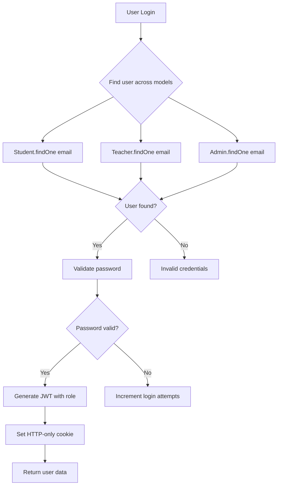

# 🔐 HighQ Classes - Authentication System Documentation (Updated)

## Table of Contents

1. [Overview](#overview)
2. [Independent Model Architecture](#independent-model-architecture)
3. [User Roles & Models](#user-roles--models)
4. [Authentication Flow](#authentication-flow)
5. [API Endpoints](#api-endpoints)
6. [Middleware Usage](#middleware-usage)
7. [Security Features](#security-features)
8. [Frontend Integration](#frontend-integration)
9. [Error Handling](#error-handling)
10. [Migration Guide](#migration-guide)

---

## Overview

The HighQ Classes authentication system has been **completely refactored** to use independent models instead of the complex User-based relationship pattern. This provides better performance, clearer code structure, and easier maintenance.

### Key Features

-   ✅ **Independent Model Architecture** - Student, Teacher, Admin models with complete authentication
-   ✅ **Universal Registration Endpoint** - One endpoint handles all roles with intelligent field processing
-   ✅ JWT-based authentication with HTTP-only cookies
-   ✅ Role-based authorization (RBAC)
-   ✅ Account security (lockout, password policies)
-   ✅ Password reset with OTP
-   ✅ Cross-model uniqueness validation
-   ✅ XSS and NoSQL injection protection
-   ✅ Rate limiting and security headers

### Universal Registration System

🎯 **Same endpoint, different models**: The registration endpoint (`POST /api/auth/register`) intelligently creates documents in the appropriate model based on the `role` field:

```json
// Same endpoint URL for all roles
POST /api/auth/register

// Student registration
{ "role": "student", "parentName": "...", "grade": "..." }

// Teacher registration
{ "role": "teacher", "qualification": "...", "experience": 5 }

// Admin registration
{ "role": "admin", "department": "...", "designation": "..." }
```

**Result**: Creates document in Student/Teacher/Admin model respectively, with role-specific fields processed automatically.

---

## Independent Model Architecture

### NEW Architecture (Current)

```
Independent Model Structure:

┌─────────────────────────────┐
│      Student Model          │
│      ==============         │
│   Authentication Fields:    │
│   - _id, name, email        │
│   - password, mobile        │
│   - status, role, security  │
│                            │
│   Student-Specific Fields:  │
│   - parentName, grade       │
│   - schoolName, attendance  │
│   - courses, payments       │
└─────────────────────────────┘

┌─────────────────────────────┐
│      Teacher Model          │
│      ==============         │
│   Authentication Fields:    │
│   - _id, name, email        │
│   - password, mobile        │
│   - status, role, security  │
│                            │
│   Teacher-Specific Fields:  │
│   - employeeId, qualification│
│   - experience, department  │
│   - subjects, batches       │
└─────────────────────────────┘

┌─────────────────────────────┐
│       Admin Model           │
│       =============         │
│   Authentication Fields:    │
│   - _id, name, email        │
│   - password, mobile        │
│   - status, role, security  │
│                            │
│   Admin-Specific Fields:    │
│   - employeeId, department  │
│   - permissions, accessLevel│
│   - systemSettings         │
└─────────────────────────────┘
```

### Benefits of Independent Models:

-   ✅ **No complex relationships** - Each model is self-contained
-   ✅ **Faster queries** - No joins needed, direct access
-   ✅ **Data consistency** - All user data in one document
-   ✅ **Easier maintenance** - Clear separation of concerns
-   ✅ **Type safety** - req.user contains actual Student/Teacher/Admin document

### Authentication Flow



---

## User Roles & Models

### 1. Student Model (`models/Student.js`)

Complete independent model with authentication and academic data:

```javascript
{
  // Authentication fields (built-in)
  name: String,           // Full name (required, 3-50 chars)
  email: String,          // Unique email (required, validated)
  password: String,       // Hashed password (required, min 6 chars)
  mobile: String,         // 10-digit mobile number (required, unique)
  status: String,         // 'pending', 'active', 'suspended', 'inactive'
  role: String,           // Always 'student'
  profilePicture: String, // URL to profile image

  // Student-specific fields
  parentName: String,     // Parent/Guardian name (required)
  parentContact: String,  // Parent contact number (required)
  grade: String,          // Current grade/class (required)
  schoolName: String,     // School name (required)
  dateOfBirth: Date,      // Student's date of birth
  address: Object,        // Address details

  // Academic data
  batch: ObjectId,        // Reference to Batch
  courses: [ObjectId],    // Enrolled courses
  attendance: Object,     // Attendance tracking
  examHistory: [Object],  // Exam results
  paymentHistory: [ObjectId], // Payment records

  // Security fields
  loginAttempts: Number,      // Failed login count
  lockUntil: Date,           // Account lockout timestamp
  passwordResetToken: String, // Hashed OTP for password reset
  passwordResetExpires: Date, // OTP expiry time
  lastLogin: Date,           // Last successful login

  // Timestamps
  createdAt: Date,
  updatedAt: Date
}
```

#### Student Model Methods

```javascript
// Authentication methods
student.matchPassword(password); // Compare password
student.generateToken(); // Generate JWT
student.incLoginAttempts(); // Handle failed login
student.resetLoginAttempts(); // Reset login attempts

// Utility methods
student.isLocked; // Virtual for lockout status
student.calculateAttendance(); // Calculate attendance percentage
```

### 2. Teacher Model (`models/Teacher.js`)

Complete independent model with authentication and professional data:

```javascript
{
  // Authentication fields (same as Student)
  name: String,
  email: String,          // Unique across all models
  password: String,
  mobile: String,         // Unique across all models
  status: String,
  role: String,           // Always 'teacher'
  profilePicture: String,

  // Teacher-specific fields
  employeeId: String,     // Unique employee ID
  qualification: String,  // Educational qualification (required)
  experience: Number,     // Years of experience (required)
  specialization: String, // Teaching specialization (required)
  department: String,     // Department/subject area
  subjects: [String],     // Subjects they can teach
  bio: String,           // Teacher bio/description

  // Professional data
  batches: [ObjectId],    // Assigned batches
  courseIds: [ObjectId],  // Courses they handle
  permissions: Object,    // Teaching permissions

  // Security fields (same as Student)
  loginAttempts: Number,
  lockUntil: Date,
  passwordResetToken: String,
  passwordResetExpires: Date,
  lastLogin: Date,

  // Timestamps
  createdAt: Date,
  updatedAt: Date
}
```

### 3. Admin Model (`models/Admin.js`)

Complete independent model with authentication and administrative data:

```javascript
{
  // Authentication fields (same as others)
  name: String,
  email: String,          // Unique across all models
  password: String,
  mobile: String,         // Unique across all models
  status: String,         // Usually 'active'
  role: String,           // Always 'admin'
  profilePicture: String,

  // Admin-specific fields
  employeeId: String,     // Unique employee ID
  department: String,     // Administrative department
  designation: String,    // Job title
  accessLevel: Number,    // Access level (1-5)

  // Administrative data
  permissions: [String],   // Array of permission strings
  managedDepartments: [String], // Departments they manage
  systemSettings: Object,  // System access settings

  // Security fields (same as others)
  loginAttempts: Number,
  lockUntil: Date,
  passwordResetToken: String,
  passwordResetExpires: Date,
  lastLogin: Date,

  // Timestamps
  createdAt: Date,
  updatedAt: Date
}
```

#### Admin Permissions

```javascript
const ADMIN_PERMISSIONS = [
    "user_management", // Create, update, delete users
    "course_management", // Manage courses and curriculum
    "batch_management", // Manage batches and schedules
    "fee_management", // Handle fees and payments
    "notice_management", // Create and manage notices
    "attendance_management", // View and modify attendance
    "material_management", // Manage study materials
    "recording_management", // Manage recorded sessions
    "system_settings", // System configuration
    "reports_access", // Access to reports and analytics
];
```

---

## Authentication Flow

### 1. Registration Process (Independent Models)

```javascript
export const register = async (req, res) => {
    const { name, email, password, mobile, role, ...additionalData } = req.body;

    // Step 1: Check uniqueness across ALL models
    const existingEmail = await Promise.all([
        Student.findOne({ email }),
        Teacher.findOne({ email }),
        Admin.findOne({ email }),
    ]);

    if (existingEmail.some((user) => user !== null)) {
        return res.status(409).json({ message: "Email already registered" });
    }

    // Step 2: Create user directly in appropriate model
    let newUser;
    switch (role) {
        case "student":
            newUser = new Student({
                name,
                email,
                password,
                mobile,
                parentName: additionalData.parentName,
                grade: additionalData.grade,
                schoolName: additionalData.schoolName,
            });
            break;
        case "teacher":
            newUser = new Teacher({
                name,
                email,
                password,
                mobile,
                employeeId: `T${Date.now()}`,
                qualification: additionalData.qualification,
                experience: additionalData.experience,
                specialization: additionalData.specialization,
            });
            break;
        case "admin":
            newUser = new Admin({
                name,
                email,
                password,
                mobile,
                employeeId: `A${Date.now()}`,
                department: additionalData.department,
                status: "active", // Admins are auto-approved
            });
            break;
    }

    await newUser.save(); // Password auto-hashed by pre-save middleware
};
```

### 2. Login Process (Cross-Model Search)

```javascript
export const login = async (req, res) => {
    const { email, password } = req.body;

    // Step 1: Find user across all models
    let user = null;
    let userRole = null;

    user = await Student.findOne({ email }).select("+password");
    if (user) userRole = "student";

    if (!user) {
        user = await Teacher.findOne({ email }).select("+password");
        if (user) userRole = "teacher";
    }

    if (!user) {
        user = await Admin.findOne({ email }).select("+password");
        if (user) userRole = "admin";
    }

    if (!user) {
        return res.status(401).json({ message: "Invalid credentials" });
    }

    // Step 2: Security checks
    if (user.status !== "active") {
        return res.status(403).json({ message: "Account not active" });
    }

    if (user.isLocked) {
        return res.status(423).json({ message: "Account temporarily locked" });
    }

    // Step 3: Verify password
    const isPasswordCorrect = await user.matchPassword(password);
    if (!isPasswordCorrect) {
        await user.incLoginAttempts();
        return res.status(401).json({ message: "Invalid credentials" });
    }

    // Step 4: Generate JWT with role information
    const token = user.generateToken(); // Contains user._id and role

    // Step 5: Set HTTP-only cookie and return response
    res.cookie("authToken", token, {
        httpOnly: true,
        secure: process.env.NODE_ENV === "production",
        maxAge: 7 * 24 * 60 * 60 * 1000, // 7 days
    });

    res.json({
        success: true,
        data: {
            id: user._id,
            name: user.name,
            email: user.email,
            role: userRole,
            status: user.status,
        },
    });
};
```

### 3. Authentication Middleware (Role-Based Routing)

```javascript
export const protect = async (req, res, next) => {
    try {
        // Step 1: Extract and verify JWT
        const token =
            req.cookies.authToken || req.headers.authorization?.split(" ")[1];
        const decoded = jwt.verify(token, process.env.JWT_SECRET);

        // Step 2: Find user in appropriate model based on role
        let user;
        switch (decoded.role) {
            case "student":
                user = await Student.findById(decoded.id).select("-password");
                break;
            case "teacher":
                user = await Teacher.findById(decoded.id).select("-password");
                break;
            case "admin":
                user = await Admin.findById(decoded.id).select("-password");
                break;
            default:
                return res.status(401).json({ message: "Invalid token role" });
        }

        if (!user) {
            return res.status(401).json({ message: "User not found" });
        }

        // Step 3: Attach complete user object to request
        user.role = decoded.role; // Ensure role is available
        req.user = user; // Now contains full Student/Teacher/Admin document
        next();
    } catch (error) {
        return res.status(401).json({ message: "Authentication failed" });
    }
};
```

---

## API Endpoints (Updated)

### Universal Registration Endpoint

🔥 **One endpoint handles all user types** - The same URL intelligently processes different roles:

```http
POST /api/auth/register
Content-Type: application/json
```

#### Student Registration Example

```json
{
    "name": "John Doe",
    "email": "john@example.com",
    "password": "SecurePass123",
    "mobile": "1234567890",
    "role": "student",
    "parentName": "Jane Doe",
    "parentContact": "9876543210",
    "grade": "10th",
    "schoolName": "ABC School"
}
```

**Result**: Creates document in `Student` model with student-specific fields.

#### Teacher Registration Example

```json
{
    "name": "Prof. Smith",
    "email": "smith@example.com",
    "password": "SecurePass123",
    "mobile": "1234567890",
    "role": "teacher",
    "qualification": "M.Sc Physics",
    "experience": 5,
    "specialization": "Physics",
    "department": "Science"
}
```

**Result**: Creates document in `Teacher` model with professional fields.

#### Admin Registration Example

```json
{
    "name": "Admin User",
    "email": "admin@example.com",
    "password": "SecurePass123",
    "mobile": "1234567890",
    "role": "admin",
    "department": "IT",
    "designation": "System Administrator"
}
```

**Result**: Creates document in `Admin` model with administrative fields.

### How Universal Registration Works

1. **Role Detection**: System reads `role` field to determine target model
2. **Cross-Model Validation**: Checks email/mobile uniqueness across ALL models
3. **Field Processing**: Applies role-specific fields with intelligent defaults
4. **Model Creation**: Creates document in appropriate Student/Teacher/Admin model

### Registration with Independent Models

"grade": "10th",
"schoolName": "ABC School"
}

Response:
{
"success": true,
"message": "Registration successful! Please wait for approval.",
"data": {
"id": "student_id_here",
"name": "John Doe",
"email": "john@example.com",
"role": "student",
"status": "pending"
}
}

````

### Profile Access (Direct Model Data)

```http
GET /api/auth/me
Authorization: Bearer <token>

Response:
{
  "success": true,
  "data": {
    "id": "user_id",
    "name": "John Doe",
    "email": "john@example.com",
    "mobile": "1234567890",
    "role": "student",
    "profilePicture": "/placeholder.svg",
    "status": "active",

    // Student-specific fields (if student)
    "parentName": "Jane Doe",
    "parentContact": "9876543210",
    "grade": "10th",
    "schoolName": "ABC School",
    "batch": "batch_id",
    "attendance": {
      "percentage": 85,
      "totalClasses": 100,
      "attendedClasses": 85
    },

    "createdAt": "2024-01-01T00:00:00.000Z"
  }
}
````

---

## Frontend Integration (Updated)

### Making Authenticated Requests

```javascript
// All role data available directly
const ProfileComponent = () => {
    const [user, setUser] = useState(null);

    useEffect(() => {
        const fetchProfile = async () => {
            try {
                const response = await fetch("/api/auth/me", {
                    credentials: "include", // Important for cookies
                });

                if (response.ok) {
                    const data = await response.json();
                    setUser(data.data);

                    // All role-specific data is available:
                    if (data.data.role === "student") {
                        console.log("Parent:", data.data.parentName);
                        console.log("Grade:", data.data.grade);
                        console.log(
                            "Attendance:",
                            data.data.attendance.percentage
                        );
                    } else if (data.data.role === "teacher") {
                        console.log("Qualification:", data.data.qualification);
                        console.log("Experience:", data.data.experience);
                        console.log("Department:", data.data.department);
                    } else if (data.data.role === "admin") {
                        console.log("Employee ID:", data.data.employeeId);
                        console.log("Permissions:", data.data.permissions);
                    }
                }
            } catch (error) {
                console.error("Profile fetch error:", error);
            }
        };

        fetchProfile();
    }, []);

    return (
        <div>
            {user && (
                <div>
                    <h1>Welcome, {user.name}</h1>
                    <p>Role: {user.role}</p>
                    {/* Render role-specific UI based on available data */}
                </div>
            )}
        </div>
    );
};
```

### Role-Based Components

```javascript
const RoleBasedDashboard = ({ user }) => {
    if (user.role === "student") {
        return (
            <StudentDashboard
                student={user}
                attendance={user.attendance}
                courses={user.courses}
            />
        );
    } else if (user.role === "teacher") {
        return (
            <TeacherDashboard
                teacher={user}
                batches={user.batches}
                subjects={user.subjects}
            />
        );
    } else if (user.role === "admin") {
        return (
            <AdminDashboard
                admin={user}
                permissions={user.permissions}
                managedDepartments={user.managedDepartments}
            />
        );
    }
};
```

---

## Migration Guide

### For Developers

If you're working with the old User-based system, here are the key changes:

#### OLD Way (User + Role Models):

```javascript
// OLD: Complex relationship queries
const student = await Student.findOne({ user: req.user.id })
    .populate("user")
    .populate("courses");

const user = student.user; // Get user data
const academic = student; // Get academic data
```

#### NEW Way (Independent Models):

```javascript
// NEW: Direct access
const student = req.user; // Already contains everything!

// All data available directly:
console.log(student.name); // Authentication data
console.log(student.parentName); // Student-specific data
console.log(student.courses); // Academic data
```

### Key Benefits of Migration:

1. **Performance**: Single database query instead of joins
2. **Simplicity**: No complex relationships to manage
3. **Type Safety**: req.user is actual Student/Teacher/Admin
4. **Data Consistency**: All user data in one atomic document
5. **Easier Testing**: Independent models are easier to mock

### Breaking Changes:

1. **No User model**: User.js has been completely removed
2. **Direct model access**: Controllers work directly with Student/Teacher/Admin
3. **Updated middleware**: protect() now searches across all models
4. **Profile structure**: API responses contain all data in one object

---

## Conclusion

The new independent model architecture provides:

-   ✅ **Cleaner codebase** - No complex User → Role relationships
-   ✅ **Better performance** - Direct model access, no joins
-   ✅ **Easier development** - All user data in req.user
-   ✅ **Type safety** - Clear model boundaries
-   ✅ **Production ready** - Comprehensive security features

Your 8-member team can now work with a clear, maintainable authentication system! 🚀

---

**Last Updated**: July 2025  
**Maintained By**: HighQ Classes Development Team  
**Architecture**: Independent Model System
